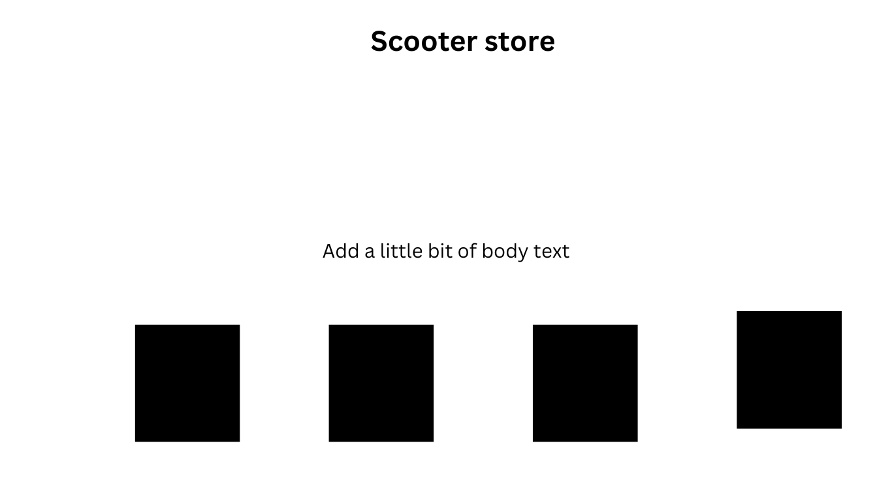
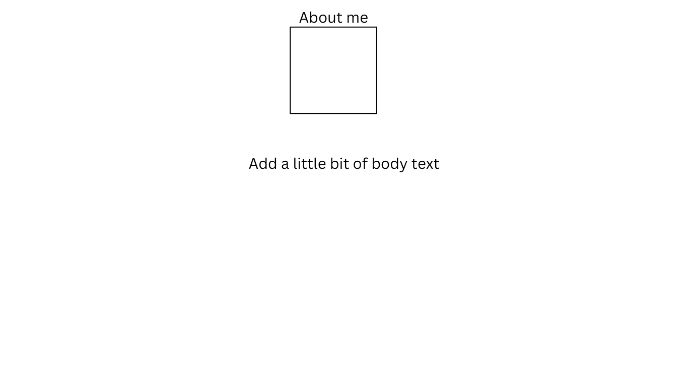

# portfolio

Capstone project

## About

- index.html - Built with HTML, CSS and Bootstrap- the homepage holds a list of projects completed during the first cohort at CodeX Academy. it is built with cards that give the name and a brief description of the project. The cards also contain a link to the Github Repository. In addition to cards, this page contains a Navbar with additional links to the other pages in the Capstone Project
- store.html- Built with HTML, CSS and Bootstrap-This page was built HTML CSS this page contains a Navbar with additional links to the other pages in the Capstone Project. Cards are used to display the scooters with Images of the scooters and buttons used to reserve the rental. I also included an off canvas function that, once clicked, displays another card containing another available scooter with another "rent me" button.
- script.js - the JavaScript file is used for the Store page "store.html". It uses a simple Array for each scooter available for rental. also hold a for loop to reset the "reserved" scooter.
- aboutme.html - Built with HTML, CSS and Bootstrap - This page displays A headshot image in a div element contained in div. It is constructed with rows/columns but only utilizing the center column. Under the image is a brief description of the authors' career history. At the bottom of the page there are links other projects completed by the author.
- amstyle.css - this page contains the CSS styling for the about me page. It contains styling for the background image
- styles.css - this page contains the styling for the index.html page. It controls the background image and the cards' dimensions.
- sstyles.css - this page contains the background image for the store.html page.
- index.css - no css styling was required for index.html

## Built With

\_ HTML

- CSS
- Bootstrap
- JavaScript

## Roadmap

- [x] index.html
- [x] script.js
- [x] Bootstrap include
- [x] Wire Frame 

## Contact

Author: Desmon Garrison email: desmongarrison2@gmail.com

## Acknowledgements

- https://www.w3schools.com/tags/default.asp
- https://www.quirksmode.org/js/boolean.html
- https://getbootstrap.com/
